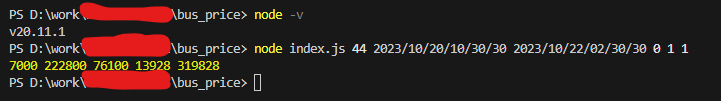

# バス料金計算アルゴリズム

- 開発環境: node.js 20.11.1

# 説明

- 問題を確認するには、この [概念](https://busket.notion.site/WTT-ecf75f3c7c3846a69ada79dcc2ba1a77) を参照してください。

## ❯ はじめる

### ステップ 1: 開発環境をセットアップする

何かを始める前に、開発環境をセットアップする必要があります。

インストール [Node.js and NPM](https://nodejs.org/en/download/)

### ステップ2: cli ツールを実行する

```bash
node index.js params
```

- params は入力変数です。入力パターンはこんな感じです。

```bash
node index.js 44 2023/10/20/10/30/30 2023/10/22/02/30/30 0 1 1
```

- 44: 距離
- 2023/10/20/10/30/30: 開始時刻の年/月/日/時/分/秒
- 2023/10/22/02/30/30: 終了時刻の年/月/日/時/分/秒
- 0: バスタイプインデックス [大型, 中型, マイクロ, ハイエース]。この場合、タイプは 大型です。
- 1: バスの数。
- 1: 場所のインデックス。 この場合、それは北海道運輸局です。

### 手計算

- キロ制運賃: 140 * 50 = 7000 (44 => 50)
- 時間制運賃: 5570 * 40 = 222800
- 帰着交替運転者配置料金日時: 10 * 50 +1890 * 40 =  76100
- 深夜早朝料金: 13928
- 運賃料金の合計価格: 700 + 222800 + 76100 + 13928 = 319828

### 深夜早朝料金計算アルゴリズム

- 開始時刻の前日である日付を計算します。この時間を標準時間として設定します。
- 標準時間から開始時間までの時間(22:00~5:00)を計算します。
- 標準時間から終了時間までの合計時間(22:00~5:00)を計算します。
- 開始から終了までの実時間(22:00~5:00)とその時間内の距離を計算します。
- ボーナス料金を計算します。

### 結果

